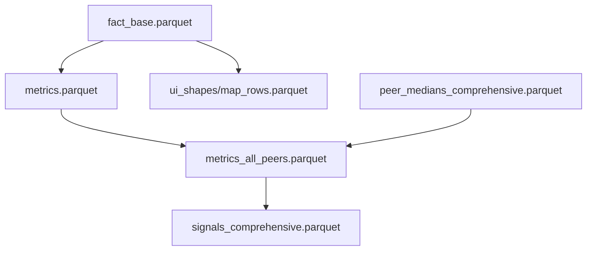

# API Schema Documentation

**Single Source of Truth** for data contracts between:
- **Parquet files** (ETL pipeline outputs)
- **API endpoints** (FastAPI backend)
- **UI components** (React frontend)

## Quick Reference Matrix

| Parquet File | API Endpoint | UI Component | Purpose |
|-------------|-------------|-------------|---------|
| `fact_base.parquet` | Internal only | N/A | Raw BACI trade facts |
| `metrics.parquet` | Internal only | N/A | Base trade metrics |
| `metrics_all_peers.parquet` | `/bars`, `/trend`, `/insights_data` | ProductBarChart, TrendMini, KeyData | Enriched metrics with peer data |
| `signals_comprehensive.parquet` | `/signals`, `/top_signals` | SignalsList | Pre-computed trade signals |
| `ui_shapes/map_rows.parquet` | `/map_v2` | WorldMap | Map visualization data |
| `peer_medians_comprehensive.parquet` | `/peer_groups/*` | BenchmarkGroup | Peer group analysis |

---

## 1. Parquet File Schemas

### 1.1 Core Data Pipeline

#### `fact_base.parquet` (337,888 rows)
**Purpose:** Raw bilateral trade facts from BACI dataset
```typescript
{
  year: number                    // Trade year (2019-2023)
  hs6: string                    // 6-digit HS product code
  partner_iso3: string           // Partner country ISO3 code
  export_cz_to_partner: number   // CZ export to partner (USD)
  import_partner_total: number   // Partner's total imports (USD)
  export_cz_total_for_hs6: number // CZ global exports for this HS6 (USD)
}
```

#### `metrics.parquet` (337,888 rows)
**Purpose:** Basic trade metrics computed from fact_base
```typescript
{
  // Inherited from fact_base
  year: number
  hs6: string
  partner_iso3: string
  export_cz_to_partner: number
  import_partner_total: number
  export_cz_total_for_hs6: number
  
  // Computed metrics
  podil_cz_na_importu: number         // CZ market share in partner imports (0-1)
  YoY_export_change: number           // Year-over-year export change (%)
  partner_share_in_cz_exports: number // Partner's share of CZ exports (0-1)
  YoY_partner_share_change: number    // YoY change in partner share (%)
}
```

#### `metrics_all_peers.parquet` (337,888 rows)
**Purpose:** Metrics enriched with ALL peer group methodologies
```typescript
{
  // Inherited from metrics.parquet (all fields above)
  
  // Peer methodology: kmeans_cosine_hs2_shares
  median_peer_share_kmeans_cosine_hs2_shares: number  // Peer median market share
  peer_countries_kmeans_cosine_hs2_shares: string     // JSON array of peer ISO3s
  peer_count_kmeans_cosine_hs2_shares: number         // Number of peer countries
  delta_vs_peer_kmeans_cosine_hs2_shares: number      // CZ share - peer median
  
  // Peer methodology: human (geographic)
  median_peer_share_human: number
  peer_countries_human: string
  peer_count_human: number  
  delta_vs_peer_human: number
}
```

### 1.2 Signal Generation

#### `signals_comprehensive.parquet` (5,595 rows)
**Purpose:** Pre-computed trade opportunity signals with three-methodology support
```typescript
{
  type: 'Peer_gap_human' | 'Peer_gap_matching' | 'Peer_gap_opportunity' | 'YoY_export_change' | 'YoY_partner_share_change'
  year: number                    // Signal year (2023)
  hs6: string                    // 6-digit product code (zero-padded)
  partner_iso3: string           // Partner country ISO3
  intensity: number              // Methodology-specific signal strength score
  value: number                  // Market share or trade value
  yoy: number                    // Year-over-year change (%) - null for peer gap signals
  peer_median: number            // Peer group median share (null for YoY signals)
  delta_vs_peer: number          // CZ share vs peer median gap (null for YoY signals)
  method: 'human' | 'kmeans_cosine_hs2_shares' | 'opportunity' | 'yoy_export' | 'yoy_share'
  peer_countries: string         // JSON array of peer countries (empty for YoY signals)
  peer_count: number             // Number of peers (0 for YoY signals)
  methodology_explanation: string // Human-readable methodology explanation
}
```

### 1.3 UI Data

#### `ui_shapes/map_rows.parquet` (367,329 rows)
**Purpose:** Pre-computed world map visualization data
```typescript
{
  hs6: number                           // Product code (numeric)
  year: number                         // Year
  partner_id: number                   // Partner country numeric ID
  iso3: string                        // ISO3 country code
  name: string                        // Country name
  cz_curr: number                     // CZ export current year (USD)
  cz_prev: number                     // CZ export previous year (USD)
  imp_total: number                   // Partner total imports (USD)
  cz_world: number                    // CZ global exports for HS6 (USD)
  cz_world_prev: number               // CZ global exports previous year (USD)
  delta_export_abs: number            // Absolute export change (USD)
  cz_share_in_partner_import: number  // CZ market share (0-1)
  partner_share_in_cz_exports: number // Partner share of CZ exports (0-1)
}
```

### 1.4 Peer Group Analysis

#### `peer_medians_comprehensive.parquet` (1,193,862 rows)
**Purpose:** Comprehensive peer median calculations for all methodologies
```typescript
{
  year: number                    // Analysis year
  hs6: string                    // Product code
  partner_iso3: string           // Market/partner country
  country_iso3: string           // Reference country (usually CZE)
  method: string                 // Peer methodology identifier
  cluster_id: number             // Cluster/group identifier
  k_param: number                // K-means parameter (if applicable)
  peer_median_share: number      // Median market share of peer group
  peer_countries: string         // JSON array of peer country codes
  peer_count: number             // Number of countries in peer group
}
```

---

## 2. API Endpoint Schemas

### 2.1 Map Endpoints

#### `GET /map_v2`
**Purpose:** Unified world map data
```typescript
// Query Parameters
{
  hs6: string      // Required: 6-digit product code
  year: number     // Required: year
  metric: string   // Optional: 'delta_export_abs' | 'cz_share_in_partner_import' | 'export_value_usd' | 'partner_share_in_cz_exports'
  top?: number     // Optional: limit results
}

// Response
Array<{
  iso3: string        // Country ISO3 code
  name: string        // Country name
  value: number | null // Metric value (null for missing data)
}>
```

### 2.2 Signals Endpoints

#### `GET /signals`
**Purpose:** Query pre-computed signals by methodology
```typescript
// Query Parameters  
{
  country?: string  // Optional: filter by country ISO3
  hs6?: string     // Optional: filter by product code
  type?: string    // Optional: filter by signal type
  method?: 'human' | 'trade_structure' | 'opportunity' | 'yoy_export' | 'yoy_share'  // Methodology
  limit?: number   // Optional: max results (default: 10)
}

// Response
Array<{
  type: string              // Signal type
  year: number             // Signal year
  hs6: string              // Product code  
  hs6_name?: string        // Product name (enriched)
  partner_iso3: string     // Partner country
  partner_name?: string    // Partner name (enriched)
  intensity: number        // Signal strength
  value: number            // Trade value (USD)
  yoy: number              // Year-over-year change (%)
  peer_median?: number     // Peer median (for gap signals)
  delta_vs_peer?: number   // Gap vs peers
  method: string           // Methodology identifier
  peer_countries: string   // JSON array of peer countries
  peer_count: number       // Peer group size
  methodology_explanation: string // Human explanation
}>
```

#### `GET /top_signals`
**Purpose:** Balanced top signals for a country (legacy compatibility)
```typescript
// Query Parameters
{
  country: string   // Required: country ISO3
  year?: number    // Optional: year filter
  limit?: number   // Optional: max results (default: 100)
}

// Response: Same as /signals but balanced across signal types
```

#### `GET /signals/methodologies`
**Purpose:** Available peer group methodologies
```typescript
// Response
Array<{
  method: 'human' | 'trade_structure' | 'opportunity' | 'yoy_export' | 'yoy_share'
  name: string            // Display name ('Curated Regional Groups', 'Trade Structure Groups', etc.)
  description: string     // Technical description
  signal_count: number    // Available signals (531-532 for peer groups, 2000 for YoY)
  signal_types: string[]  // Signal type mappings (['Peer_gap_human'], etc.)
}>
```

#### `GET /signals/comprehensive`
**Purpose:** Complete signal data for country-product combination across all methodologies
```typescript
// Query Parameters
{
  country: string  // Required: target country ISO3
  hs6: string     // Required: 6-digit product code
}

// Response
{
  country: string   // Country ISO3
  hs6: string      // Zero-padded HS6 code
  methodologies: {
    [method: string]: {
      signal: SignalObject           // Complete signal data
      peer_countries: string[]       // Peer country ISO3 codes
      explanation: string            // Human-readable explanation
      methodology_name: string       // Display name
    }
  }
}
```

### 2.3 Products/Bars Endpoints

#### `GET /bars`
**Purpose:** Unified bar chart data for multiple modes
```typescript
// Query Parameters
{
  mode: 'products' | 'partners' | 'peer_compare'  // Required: chart mode
  hs6?: string        // Product code (required for partners/peer_compare)
  year?: number       // Year filter
  country?: string    // Country filter (for products mode)
  peer_group?: string // Peer group filter (for peer_compare mode)
  top?: number        // Limit results (default: 10)
  hs2?: string        // HS2 chapter filter
}

// Response
Array<{
  id: string           // Unique identifier
  name: string         // Display name
  value: number        // Numeric value
  value_fmt: string    // Formatted value for display
  unit: string         // Unit descriptor
}>
```

#### `GET /products`
**Purpose:** Product bars (legacy compatibility)
```typescript
// Query Parameters
{
  year?: number       // Year filter
  top?: number        // Limit results (default: 10)
  country?: string    // Country filter
  hs2?: string | number // HS2 chapter filter
}

// Response: Same format as /bars
```

#### `GET /trend`
**Purpose:** Time series data for product
```typescript
// Query Parameters
{
  hs6: string     // Required: product code
  years?: number  // Lookback years (default: 10)
}

// Response
{
  series: Array<{
    year: number
    export_value_usd: number
    export_value_fmt: string
  }>
  meta: {
    hs6: string
    hs6_name: string
    unit: string
  }
}
```

### 2.4 Insights Endpoints

#### `GET /insights`
**Purpose:** Generated insights text
```typescript
// Query Parameters
{
  importer: string  // Required: country ISO3
  hs6: string      // Required: product code  
  year: number     // Required: year
}

// Response
{
  insight: string  // Generated insights text
}
```

#### `GET /insights_data`
**Purpose:** Structured data for KeyData component
```typescript
// Query Parameters
{
  importer: string  // Required: country ISO3
  hs6: string      // Required: product code
  year: number     // Required: year
}

// Response
{
  c_import_total: number       // Country's total imports
  cz_share_in_c: number        // CZ market share
  median_peer_share: number    // Peer median share
  import_yoy_change: number    // Import YoY change %
  cz_to_c: number              // CZ export to country
  cz_world_total: number       // CZ global export for HS6
  cz_delta_pct: number         // YoY change %
}
```

### 2.5 Metadata Endpoints

#### `GET /controls`
**Purpose:** UI control options and labels
```typescript
// Response
{
  countries: string[]           // Available country ISO3 codes
  years: number[]              // Available years
  metrics: string[]            // Available metric types
  metric_labels: Record<string, string>  // Metric display names
}
```

#### `GET /meta`
**Purpose:** Configuration labels and thresholds
```typescript
// Response
{
  metric_labels: Record<string, string>  // Display labels
  thresholds: Record<string, number>     // Config thresholds
  status: string                         // Status indicator
}
```

#### `GET /peer_groups/explanation`
**Purpose:** Methodology explanations
```typescript
// Query Parameters
{
  method: string     // Required: methodology identifier
  country?: string   // Optional: country ISO3 (default: CZE)
  year?: number      // Optional: year (default: 2023)
}

// Response
{
  methodology_name: string        // Display name
  methodology_description: string // Technical description
  peer_countries: string[]        // Peer country codes
  explanation_text: string        // Human explanation
  cluster_name?: string           // Cluster name
  country_count: number           // Peer count
}
```

---

## 3. UI Component Data Contracts

### 3.1 WorldMap Component
**Data Source:** `GET /map_v2`
**Expected Input:**
```typescript
{
  data: Array<{
    iso3: string
    name: string
    value: number | null
  }>
  metric: 'cz_share_in_partner_import' | 'export_value_usd'
  year: number
  hs6: string
}
```

### 3.2 SignalsList Component
**Data Source:** `GET /signals` or `/top_signals`
**Expected Input:**
```typescript
{
  signals: Array<{
    id: string              // Generated from type_hs6_partner_index
    label: string           // Generated display label
    score: number           // Signal intensity
    type: string           // Signal type
    hs6: string            // Product code
    hs6_name?: string      // Product name
    partner_iso3: string   // Partner country
    partner_name?: string  // Partner name
    value: number          // Trade value
    yoy: number            // YoY change
    intensity: number      // Signal strength
    year: number           // Signal year
  }>
  onSignalClick: (signalId: string) => void
}
```

### 3.3 KeyData Component
**Data Source:** `GET /insights_data`
**Expected Input:**
```typescript
{
  data: {
    cz_to_c: number              // Bilateral export
    cz_world_total: number       // Total CZ export
    c_import_total: number       // Country imports
    cz_share_in_c: number        // CZ market share
    median_peer_share: number    // Peer median
    cz_delta_pct: number         // YoY change %
  }
  signal?: {
    hs6: string
    hs6_name?: string
    partner_iso3: string
    partner_name?: string
  }
  referenceData: {
    countryNames: Record<string, string>
    hs6Labels: Record<string, string>
    continents: Record<string, string>
    loading: boolean
  }
}
```

### 3.4 ProductBarChart Component
**Data Source:** `GET /bars` (mode=products)
**Expected Input:**
```typescript
{
  data: Array<{
    id: string
    name: string
    value: number
    value_fmt: string
    unit: string
  }>
  country?: string
  year: number
}
```

### 3.5 TrendMini Component
**Data Source:** `GET /trend`
**Expected Input:**
```typescript
{
  hs6: string
  data: {
    series: Array<{
      year: number
      export_value_usd: number
      export_value_fmt: string
    }>
    meta: {
      hs6: string
      hs6_name: string
      unit: string
    }
  }
}
```

### 3.6 BenchmarkGroup Component
**Data Source:** `GET /peer_groups/explanation`
**Expected Input:**
```typescript
{
  method: string
  country: string
  year: number
  explanation: {
    methodology_name: string
    methodology_description: string
    peer_countries: string[]
    explanation_text: string
    cluster_name?: string
    country_count: number
  }
}
```

---

## 4. Data Flow Dependencies

### 4.1 ETL Pipeline Dependencies


### 4.2 API-UI Dependencies

#### World Map Flow
1. `ui_shapes/map_rows.parquet` → `/map_v2` → `WorldMap`
2. User metric selection → re-fetch `/map_v2` with new metric
3. Map displays choropleth coloring based on selected metric

#### Signals Flow  
1. `signals_comprehensive.parquet` → `/signals` → `SignalsList`
2. User clicks signal → `useSignalHandling` → `KeyData` + `TrendMini`
3. KeyData fetches `/insights_data` for selected country-product combo

#### Product Analysis Flow
1. `metrics_all_peers.parquet` → `/bars` → `ProductBarChart`
2. Product selection → `/trend` → `TrendMini`
3. Country-product combo → `/insights` → insights text display

---

## 5. Cross-Check Matrix

When making changes, verify impact across:

| Change Type | Check Parquet | Check API | Check UI |
|------------|---------------|-----------|----------|
| **Add metric field** | Update ETL schema | Update endpoint response | Update component props |
| **Add signal type** | Update signals ETL | Update `/signals` filtering | Update SignalsList handling |
| **Change peer methodology** | Update peer_medians ETL | Update methodology endpoints | Update BenchmarkGroup |
| **Add country/product** | Update reference data | Update filtering logic | Update name resolution |
| **Change value scaling** | Update TRADE_UNITS_SCALE | Update formatting helpers | Update display components |

---

## 6. Validation Commands

### 6.1 Data Consistency Checks
```bash
# Verify USD scaling is correct
python -c "
import pandas as pd
df = pd.read_parquet('data/out/metrics_all_peers.parquet')
cz_total = df[df['year']==2023]['export_cz_total_for_hs6'].sum()/len(df[df['year']==2023]['hs6'].unique())
print(f'Czech total exports 2023: {cz_total/1_000_000_000:.1f}B USD (should be ~250B)')
"

# Check signal counts by methodology (should show balanced distribution)
python -c "
import pandas as pd
df = pd.read_parquet('data/out/signals_comprehensive.parquet')
print('Signal counts by method and type:')
print(df.groupby(['method', 'type']).size())
print()
print('Expected: ~531-532 for each peer methodology, ~2000 for YoY methods')
print('Total signals:', len(df))
"

# Validate map data coverage
python -c "
import pandas as pd
df = pd.read_parquet('data/out/ui_shapes/map_rows.parquet')
print(f'Map data: {len(df.hs6.unique())} products, {len(df.iso3.unique())} countries, {df.year.min()}-{df.year.max()}')
"
```

### 6.2 API Response Validation
```bash
# Test key endpoints with three-methodology support
curl "http://localhost:8000/controls" | jq '.countries | length'
curl "http://localhost:8000/map_v2?hs6=271019&year=2023&metric=export_value_usd" | jq 'length'
curl "http://localhost:8000/signals?country=DEU&method=human&limit=3" | jq '[.[].hs6]'
curl "http://localhost:8000/signals?country=DEU&method=trade_structure&limit=3" | jq '[.[].hs6]'  
curl "http://localhost:8000/signals?country=DEU&method=opportunity&limit=3" | jq '[.[].hs6]'
curl "http://localhost:8000/signals/methodologies" | jq '[.[] | {method, name, signal_count}]'
```

### 6.3 UI Integration Tests
```bash
cd ui && npm run test -- --run
cd ui && npm run lint
cd ui && npm run typecheck
```

---

## 7. Common Failure Patterns

### 7.1 Missing Data Symptoms
- **Map shows blank/null values** → Check HS6/year combination exists in `ui_shapes/map_rows.parquet`
- **KeyData shows "—" values** → Verify `/insights_data` returns complete data structure
- **Signals missing methodology** → Check `method` field mapping in `signals_comprehensive.parquet`

### 7.2 Scaling Issues
- **USD values too small** → Check `TRADE_UNITS_SCALE=1000` in ETL
- **Percentages out of range** → Verify share calculations use 0-1 scale, not 0-100

### 7.3 Country/Product Resolution
- **Missing country names** → Check reference data loading in `useAppData.js`
- **HS6 formatting issues** → Verify dot notation formatting in `KeyData.jsx`

---

This schema document should be updated whenever:
- New parquet files are added to ETL pipeline
- API endpoints change structure or parameters  
- UI components modify data requirements
- New peer methodologies are implemented
- Reference data structures change

**Last Updated:** 2025-01-22 (Three-Methodology System Update)
**Version:** 2.0.0